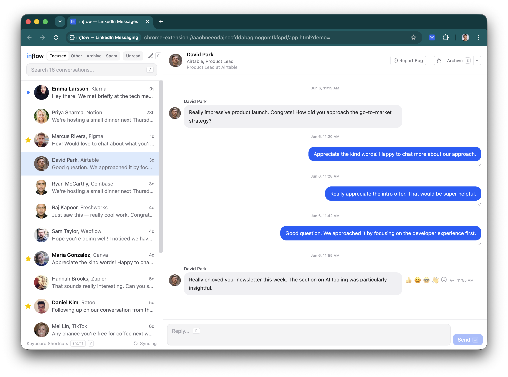
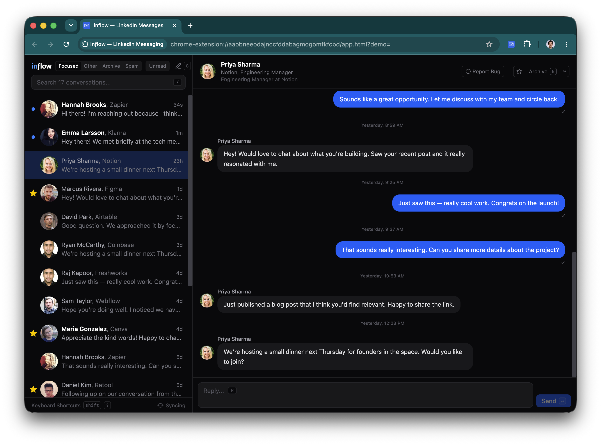
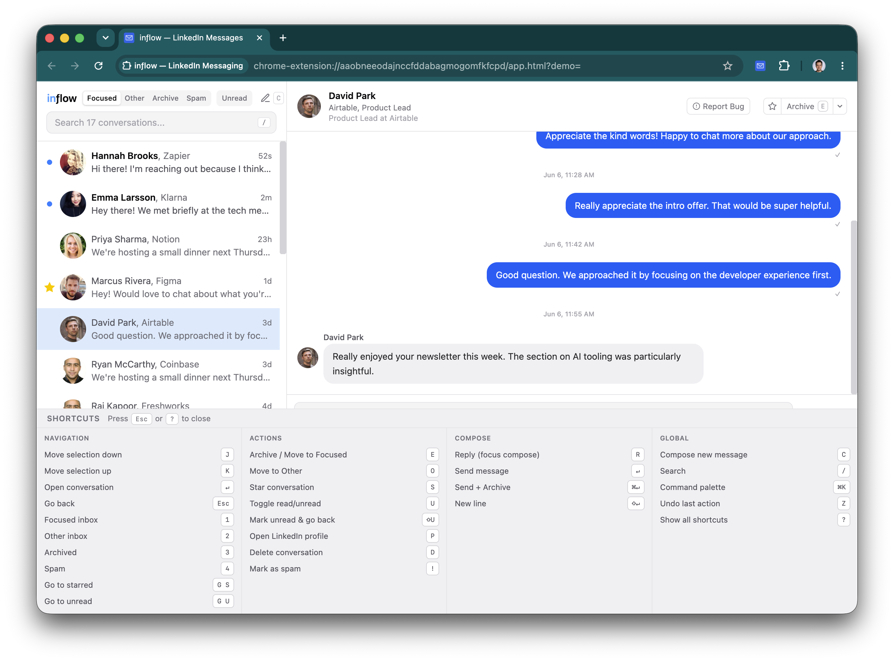

<p align="center">
  
</p>

# inflow

An experimental Chrome extension that reimagines LinkedIn messaging with a keyboard-driven, local-first UI. Built as a personal project to explore browser extension development with React, IndexedDB, and real-time streaming.

## Install

You need Google Chrome or any Chromium-based browser (Edge, Arc, Brave, etc.).
There are two ways to install — a prebuilt download, or building from source.

### Option A — Download a release (no build tools needed)

1. Go to the [latest release](https://github.com/grinich/inflow/releases/latest)
   and download `inflow-<version>-chrome.zip`.
2. Unzip it somewhere you'll keep it (the folder is the extension — don't delete it).
3. Open `chrome://extensions`, enable **Developer mode** (top right).
4. Click **Load unpacked** and select the unzipped folder.

### Option B — Build from source

Requires [Node.js](https://nodejs.org/) 18+ and npm.

```sh
git clone https://github.com/grinich/inflow.git
cd inflow
npm install
npm run build
```

Then **Load unpacked** the `dist/chrome-mv3` folder at `chrome://extensions`
(with Developer mode on).

### After loading (either option)

1. Sign into LinkedIn in any tab.
2. Click the inflow icon in the toolbar (pin it for easy access).

inflow notifies you in-app when a new release is out — see [Updating](#updating).

## Features

<table>
  <tr>
    <td></td>
    <td></td>
  </tr>
</table>

### Messaging
- Send, receive, edit, and unsend messages with file attachments
- Optimistic sending with instant UI updates; offline actions queue and replay when back online
- Emoji reactions, read receipts, shared-post previews, and draft auto-save
- Reply to a specific message, with reply-to indicators and edited-message timestamps
- Emoji shortcode autocomplete (`:smile`) and paste-to-attach for images
- New conversation composer with typeahead recipient search

### AI assist (optional, Gemini)
- Reply suggestions for incoming messages
- Inline autocomplete while composing
- Bring your own Gemini API key (set it in the app); off until configured
- **Privacy note:** when enabled, message text and participant names from the active conversation are sent to Google's Gemini API to generate suggestions. See [Google's Gemini API terms](https://ai.google.dev/gemini-api/terms). AI features are off until you add a key.

### Inbox
- Four tabs: Focused, Other, Archived, Spam
- Star, archive, move to Other, mark read/unread, mark as spam, delete
- One-click unread quick-filter toggle
- Undo for destructive actions
- Per-account IndexedDB (supports multiple LinkedIn accounts)

### Search
- Real-time local filtering across names, messages, and metadata
- Server-side LinkedIn search with pagination
- Filter autocomplete with Tab/Enter completion

| Filter | Description |
|--------|-------------|
| `is:unread` | Unread conversations |
| `is:read` | Read conversations |
| `is:starred` | Starred conversations |
| `is:group` | Group conversations |
| `has:attachment` | Has attachments |
| `has:draft` | Has an unsent draft |
| `from:name` | Filter by sender |
| `company:name` | Filter by company |
| `after:YYYY-MM-DD` | Active after date |
| `before:YYYY-MM-DD` | Active before date |
| `newer:Nd` | Active within the last N days |
| `older:Nd` | Inactive for at least N days |

### Keyboard shortcuts

| Key | Action |
|-----|--------|
| `J` / `K` | Navigate conversations |
| `Enter` | Open conversation |
| `1` / `2` / `3` / `4` | Jump to Focused / Other / Archived / Spam |
| `G S` / `G U` | Go to starred / unread |
| `R` | Reply (focus compose) |
| `Enter` | Send message (in compose) |
| `⌘+Enter` | Send + archive |
| `Shift+Enter` | New line |
| `Escape` | Back to list |
| `E` | Archive (un-archive / move to Focused in Archived tab) |
| `O` | Move to Other |
| `S` | Star / unstar |
| `U` | Toggle read / unread |
| `Shift+U` | Mark unread & go back (in thread) |
| `!` | Mark as spam |
| `P` | Open sender's LinkedIn profile |
| `D` | Delete conversation |
| `C` | Compose new message |
| `/` | Focus search |
| `Cmd+K` | Command palette |
| `Z` | Undo last action |
| `?` | Show all shortcuts |

### Sync engine
- 30-second background polling with SSE real-time updates
- Multi-category discovery (Focused, Other, Archived, Spam)
- Priority-based message backfill with configurable depth
- Scroll-triggered burst discovery and idle prefetch
- Pause / resume controls

### Thread view
- Grouped message bubbles with time separators
- Emoji reactions and read-receipt indicators
- Image lightbox, file downloads, audio/video attachments
- Light / dark / system theme

### Debug panel
- Real-time sync progress and error logs
- Diagnostic API report
- Database stats and reset controls
- Configurable backfill window

> **This project is not affiliated with, endorsed by, or associated with LinkedIn or Microsoft.**

## Disclaimer

This extension uses LinkedIn's undocumented internal APIs to read and send messages through your existing browser session. **This may violate LinkedIn's [User Agreement](https://www.linkedin.com/legal/user-agreement)** and could result in account restrictions.

This software is provided as-is for **personal and educational use only**. The author assumes no responsibility for any consequences of using it, including account suspension or data loss. Use at your own risk.

## Updating

inflow checks GitHub for new releases and shows a banner in the app when one is
available — click **What's changed** to see the release notes. To update, either:

**A. Download the latest build** — grab `inflow-<version>-chrome.zip` from the
[latest release](https://github.com/grinich/inflow/releases/latest), unzip it,
and load the unzipped folder (or replace your existing one) at `chrome://extensions`.

**B. Rebuild from source** (if you cloned the repo):

```sh
git pull
npm install
npm run build
```

Then go to `chrome://extensions` and click the reload button (↻) on the inflow
card. Your data is stored locally and is preserved across updates — the
extension uses a fixed ID, so reinstalling or moving the folder keeps your
conversations and settings.

## Development

```sh
npm run dev
```

Starts a dev server with hot reload. The extension auto-reloads in Chrome on save.

## Releasing (maintainers)

The version lives in `package.json` (WXT reads it for the manifest). To cut a release:

```sh
npm version minor   # or patch / major — bumps package.json and creates a vX.Y.Z tag
git push --follow-tags
```

Pushing the tag triggers [`.github/workflows/release.yml`](.github/workflows/release.yml),
which runs the tests, builds the extension, and publishes a GitHub Release with
auto-generated notes and the `inflow-<version>-chrome.zip` attached. Users' apps
pick up the new release via the in-app update banner.

> The extension ID is pinned by a public `key` in the manifest. The matching
> private key (`inflow-signing-key.pem`) is gitignored and only needed for `.crx`
> signing — keep a copy somewhere safe if you ever want it.

## Architecture

Chrome extension (Manifest V3) built with:

- **WXT** — extension framework
- **React 19** — UI
- **Dexie / IndexedDB** — per-account local storage with live queries
- **Zustand** — state management
- **Tailwind CSS v4** — styling
- **SSE** — real-time message streaming

## License

MIT
